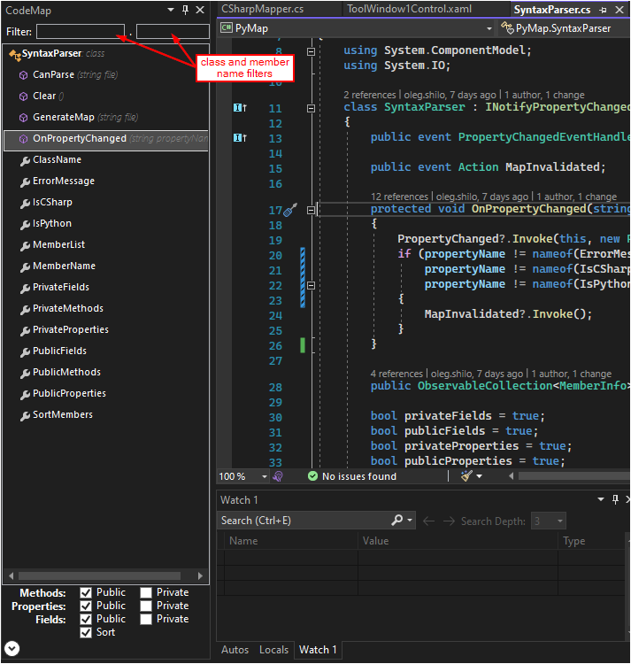
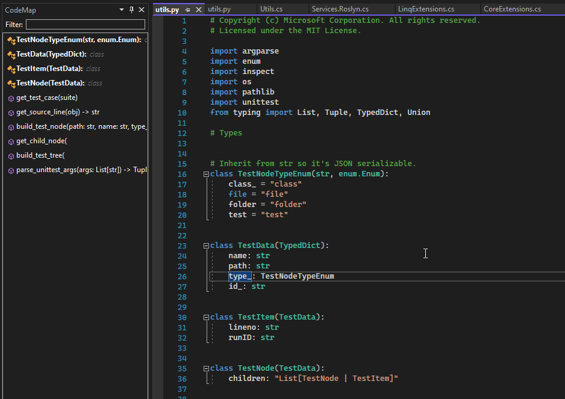
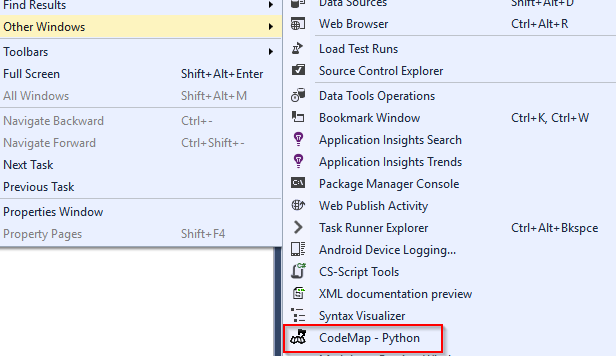

# CodeMap (ex-PyMap)
It is preferred that you install the extension via [Visual Studio Marketplace](https://marketplace.visualstudio.com/items?itemName=OlegShilo.PyMap).
This extension is built for VS2022. You can download the VS2019 version from the [Releases page](https://github.com/oleg-shilo/PyMap.VSIX/releases).
For older (pre-VS2017) releases, please visit [https://github.com/oleg-shilo/Retired-VSIX](https://github.com/oleg-shilo/Retired-VSIX).

---

This simple extension visualizes the code DOM objects defined in the active document. This extension is a partial port of the popular plugin that is available for:
* Sublime Text 3 - [Sublime CodeMap plugin](https://github.com/oleg-shilo/sublime-codemap/blob/master/README.md)
* Notepad++ - [Part of CS-Script.Npp plugin](https://github.com/oleg-shilo/cs-script.npp/blob/master/README.md)
* VS Code - [CodeMap](https://marketplace.visualstudio.com/items?itemName=oleg-shilo.codemap)

## Overview

_Code Tree viewer for source code._

Supported Language Syntax:
- C#
- Python
- JavaScript
- CSS

Historically, this extension was created to address the absence of the code tree/map view functionality for "Python Tools for Visual Studio" (PTVS). Thus, some users can remember this tool by the name of PyMap. Starting from v2.0 it has been extended with the support for C# and has been renamed into CodeMap.

The usage is straightforward and dead simple. Open any C#, .razor, Python, CSS or JS file and CodeMap will automatically build a code tree. This tree will be automatically updated when the active VS document is saved or another document tab is activated.

Clicking the item in the code tree will navigate to the location of the code element in the document.

## How is it different to the other code structure visualisation tools

Well, it is different. While there are some very solid tools of this sort available, they are focusing on different aspects of the user experience compared to CodeMap.

- CodeMap alternatives (e.g. CodeMaid, VS10x CodeMAP) are usually all about the accuracy and completeness of the information being visualised. They are investing heavily in rendering as much information as possible and even providing some refactoring functionality. Basically, "let's give the user as much information as he/she can possibly need.".

- CodeMap on the other hand has only one objective - navigation. Usability of code navigation, if to be more precise. CodeMap is trying not to get in your way and to do only a single job, but to do it well and most ergonomically.

As a developer, I want to jump to the code where a certain algorithm is implemented. I am interested in the location of the code in the file, and I want to get there in a single step. I am not interested in so many things that are important in general, but irrelevant right now. Like:

- what is the return type of my method
- is it static or not
- is it public
- what is the complexity index of the method

When I use a code map to navigate to the code:

- I am not interested in the location of the fields. Almost never. They have no behaviour, only state.
- I am not interested in the properties if it is a model class, particularly if the model is auto-generated.
- I am not interested in collapsing code tree nodes for the not-important classes and then doing it again and again simply because I have switched between the code files.
- I do not want to do refactoring (moving members around) from CodeMap. I have better tools for that.
- I do not want to explore relationships between a code element and its callers. I have better tools for that (e.g. Find All References).
- I do not want to be limited to my code tree visualisation for the current solution files only. Even if the file does not belong to the solution (e.g. decompiled source on F12 - 'Go To Definition') I also want to be able to navigate in this file freely.

One may ask, "Why then not just allow the extra flexibility in some of the existing products, instead of maintaining 'yet another one'?". This is where it becomes more complicated.

I have contacted the owner of CodeMaid and tried to contribute some of this flexibility to the excellent CodeMaid. I did it twice. But my PRs were not accepted. I am not complaining. Every OpenSource product author is entitled to have his/her vision of the product's evolution. Even if the proposed changes are not about changing the product, but only about extra customisation. Thus, I have taken my older extension and improved it to meet my own and hopefully other people's expectations. And of course, I am fully open to suggestions regarding the extension functionality.

### CodeMap - C# (or .razor)

You can filter the code tree content by the class or member name.
You can control the inclusion of the members by their visibility (private/public) for methods, properties and fields.
You can choose to sort the members of the class.

### CodeMap - Python

You can filter the code tree content by the class member name.

_Tips_

* If you want to refresh the code tree, save the active document (Ctrl+S), and it will trigger the update.
* CodeMap window can be activated via _View->Other Windows->CodeMap_ menu:
  

### CodeMap - Bookmarks

CodeMap supports map tree "bookmarks". This feature is rather a pseudo-bookmark as it implements only one aspect of a bookmark - visually indicating an item tag.  

It simply allows the user to mark some code tree nodes with a distinctive colour so these items stand out from others, somewhat less significant code map elements.
Limitations: changing the name of the code element (e.g. class, method) will trigger the loss of the associated bookmark (if any), thus you may need to reassign it again.
   
